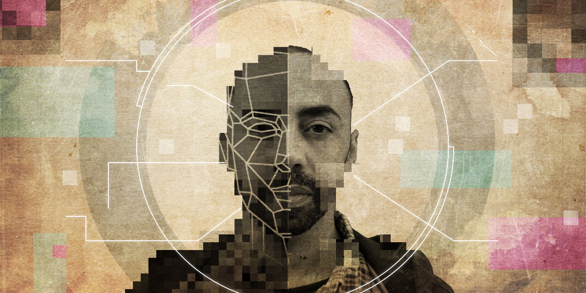
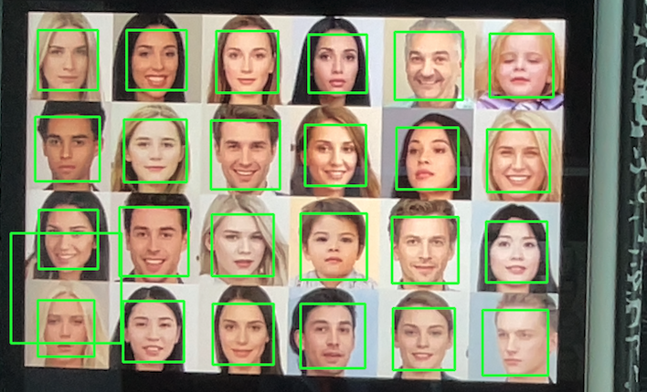

# Face Detection with OpenCV



Detect faces in real-time using your webcam with the power of OpenCV and Haar cascades.

## 🌟 Features

- **Real-time Face Detection**: Instantly detects faces from the feed of your webcam.
- **Minimalistic UI**: Just a window with the video feed and the faces highlighted.
- **Shortcuts**: Press `q` to quickly exit the application.

## 🚀 Getting Started

### Prerequisites

- Python 3.x
- OpenCV library installed. If not, you can easily install it using:
  ```bash
  pip install opencv-python
  ```

## 🖥️ Demo

Here's a quick demo of how it looks:



## 📘 How it Works

The script uses OpenCV's built-in `CascadeClassifier` to load the pre-trained Haar cascades for face detection. These cascades are trained on positive and negative images of faces and can quickly detect faces in images.

The flow is as follows:

1. Load the Haar cascades.
2. Access the webcam and capture video frame by frame.
3. Convert each frame to grayscale (because face detection is more efficient on grayscale images).
4. Detect faces in the grayscale image.
5. Draw rectangles around detected faces in the colored frame.
6. Display the frame.
7. If `q` is pressed, exit.

## 💡 Tips

- Ensure that you're in a well-lit environment for better face detection.
- Faces that are turned sideways or tilted might not be detected as easily as faces looking directly at the camera.


---
